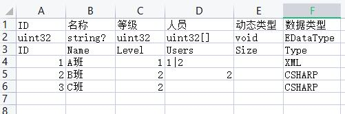

### __用来干嘛的__
> * 导出表结构  
> * 导出表数据
> * 定义消息并导出结构

### __快速开始__
__Step.1 下载一下__
* 下载源码进行编译并使用
* 下载relase版本直接使用

__Step.2 定义一下__([更多...](./doc/define.md))   
最简单的表格配置，只需要定义三行即可：  
|        |        |
| ------ | ------ |
| 备注1  | 用户ID |
| 类型   | uint32 |
| 字段名 | ID     |

__实例参考：__  


__Step.3 配置一下__([更多...](./doc/config.md))
* 本程序通过yaml文件进行配置，[格式参考](https://wenku.baidu.com/view/34ef2502a6e9856a561252d380eb6294dd8822a4.html)
* 在程序根目录下，找到conf.yaml或者将conf.template.yaml拷贝一份并重命名为conf.yaml  
* 配置文件中`export_type`赋值为4
* 删除`sheets`列表下多余的表格配置，只保留一组：
``` yaml
sheets:
  id: 1
  type: table
  file: 'data/model.xlsx'
  sheet: 'class'
  type_name: 'PClass'
```

* 删除exports下多余的导出任务，只保留数据导出和csharp代码导出即可
``` yaml
-
 id: 1
 type: "proto_bytes"
 path: "./gen/data/"
 export_type: 1
-
 id: 2
 type: "csharp"
 path: "./gen/code/DataModel.cs"
 package: "Cfg"
 ``` 

 * 全部配置如下：
 ``` yaml
package: "GameData"
pb_bytes_file_ext: ".bytes"
comment_symbol: "#"
array_split_char: ","
export_type: 4

sheets:
- 
 id: 1
 type: table
 file: 'data/model.xlsx'
 sheet: 'class'
 type_name: 'PClass'

exports:
-
 id: 1
 type: "proto_bytes"
 path: "./gen/data/"
 export_type: 1
-
 id: 2
 type: "csharp"
 path: "./gen/code/DataModel.cs"
 sheets: ""
 package: "Cfg"
```

__Step.4 运行程序__  
至此，我们已经完成表格的配置，然后只需要运行gxe.exe，就能在`gen`目录下看到生成的数据与结构, 然后我们就可以开始[使用数据](./doc/reader.md)了。  


### 更多
- [程序参数](./doc/arguments.md)
- [表格定义](./doc/define.md)
  - [基本类型](./doc/field_types.md#基本类型)
  - [16进制类型](./doc/field_types.md#bytes)
  - [空类型](./doc/field_types.md#void)
  - [计算类型](./doc/field_types.md#计算)
  - [自定义类型](./doc/field_types.md#自定义)
  - [数组分割](./doc/field_types.md#分隔符)
  - [字段规则](./doc/field_types.md#规则)
- [导出配置](./doc/config.md)
  - [导出支持](./doc/export_types.md)
  - [自定义导出](./doc/custom_export.md)
- [读取支持](./doc/reader.md)
  - [CSHARP/JS/TS](./doc/reader.md#CSHARP)
  - [GOLANG](./doc/reader.md#GOLANG)
- [消息定义](./doc/message.md)
- [CocosCreator中使用](./doc/cocoscreator.md)