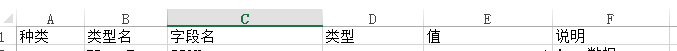
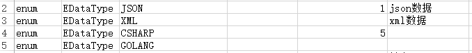
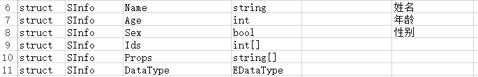
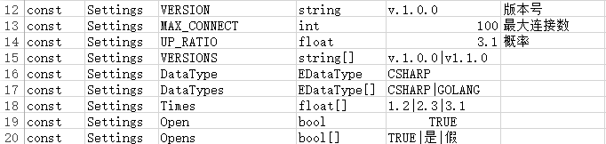
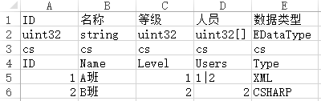
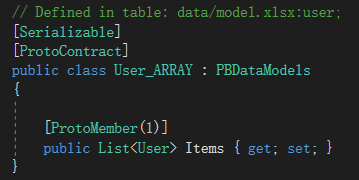

#### 表格定义

  - 定义表

    此表用于定义数据表可使用的枚举类型，以及结构体及全局配置（可不使用后两种类型）,表结构如下：

    

    - 枚举类型

    > enum, 同一枚举类型名一样，类型为空，值为枚举索引值

    

    - 结构体类型

    > struct, 此项预留

    

    - 常量类型

    > const, 用于定义游戏中的一些常量值，常量数据也会导出为二进制文件，与数据文件不同的是，导出的数据不是列表数据，仅为一个消息体（类）的数据

    

  - 数据表

    此类型用于定义数据表，前四行(忽略前后端导出配置时为三行)用于字段描述，支持使用定义表中定义的枚举类型，导出的二进制数据类型为“类型名_ARRAY”，并在此类型中定义了Items的数组作为此表数据集合，如图：

    

    

    1. 第一行为字段描述

    2. 第二行为字段类型

    3. 第三行定义此字段为前后端导出类型(可忽略)，c表示支持客户端导出，s表示支持服务端导出

    4. 第四行为字段名(忽略前后端配置时为第三行)，生成的代码结构中的名称，在go语言中，首字母将会被大写

  - 语言表

    此表是数据表的一种特例，专门用来存放多语言数据，结构同数据表。但此表会固定生成language.xx.bytes类似的多个数据文件，xx表示字段名的小写，如：language.cn.bytes

    

  - 其他

  > 数据表支持注释项，以及过滤空行等

  > 支持所有类型表的分表存储，只需类型名相同即可