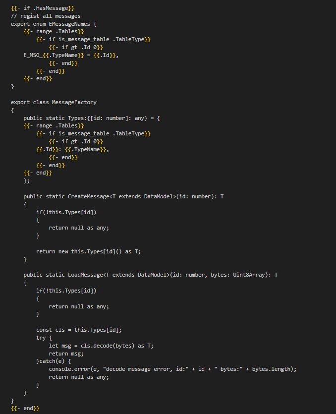
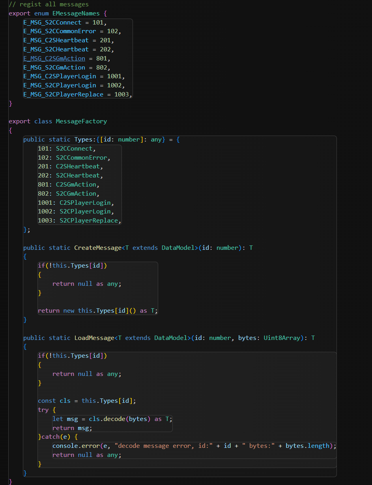
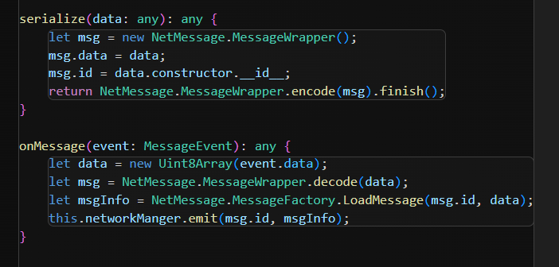
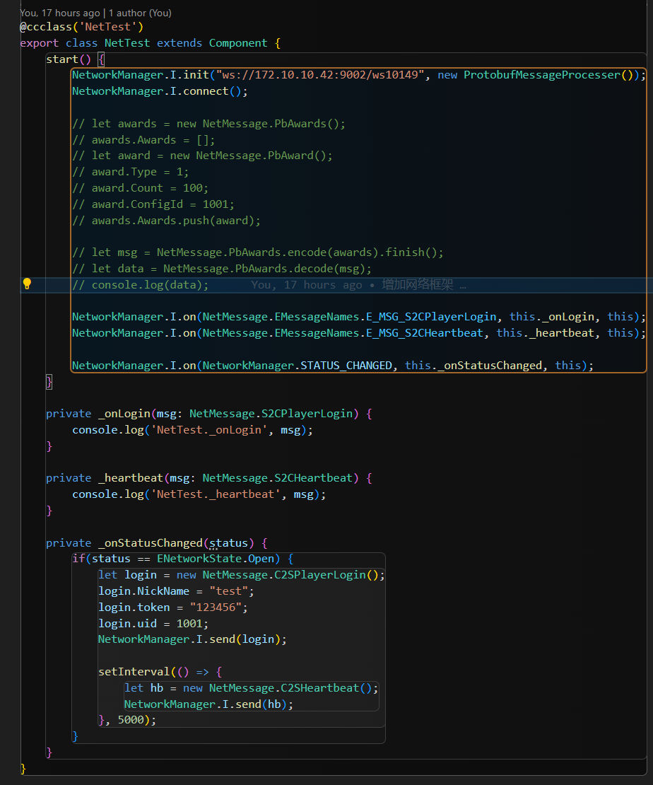

#### 消息定义
此工具除了支持表格导出以外，还支持定义xml消息，并导出为protobuf结构体；

1. define文件定义(后缀.xml)，此文件可定义`枚举类型`, 方便后续使用
  ```xml
  <define>
    <enum name="EMsgType">
        <field name="JSON" value="1" desc="用户ID"/>
        <field name="XML"/>
    </enum>
</define>
  ```

2. 消息文件定义(后缀.xml)，此文件定义用于网络传输的消息，可以使用预定义的枚举类型，以及此文件中的所有类型，当不定义消息id时，将不会对此消息进行注册
 ``` xml
 <proto>
    <message name="MessageWrapper">
        <field name="id" type="int32"/>
        <field name="data" type="bytes"/>
    </message>
    <message id="10001" name="C2S_GetPlayerInfo">
        <field name="id" alias="用户ID" type="int32" desc="用户ID"/>
        <field name="name" type="string"/>
    </message>
    <message id="10002" name="S2C_GetPlayerInfo">
        <field name="id" type="int32" desc="用户ID"/>
        <field name="name" type="string"/>      
        <field name="type" type="EMsgType"/>  
        <field name="items" type="Item[]"/>
    </message>
    <message name="Item">
        <field name="id" type="int32" desc="ID"/>
        <field name="name" type="string"/>
    </message>
  </proto>
 ```
3. 消息使用，可注册一个消息封装体，用来二次包装传送消息，方便拿取id后进行消息创建，如golang中通过id和二进制数据创建消息
 ``` golang
err, dt := LoadMessage(10001, bytes)
 ```
4. 如果感觉直接使用id不够优雅，可以直接在代码导出模板里面加上消息枚举，以及给类加上id描述，下面用ts做演示（模板代码已经集成，且增加了pb代码导出裁剪功能）：
增加如下模板代码（可忽略此处代码，至少表明生成代码可随意定制）：


生成代码如下： 


5. 然后只需要在你收到服务器消息解析，或者发送消息时构建数据就可以了


6. 最后愉快的使用他来传输数据吧！  


[图中相关引用类](../reader/typescript/net)